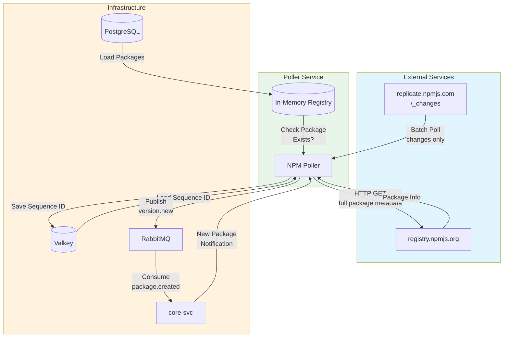

# NPM Registry Poller

Real-time NPM package version monitoring using the CouchDB changes feed.

## Overview

This service monitors the NPM registry for new package versions using `replicate.npmjs.com`, a CouchDB-compatible
replication endpoint.

**Important**: The NPM replicate endpoint does NOT support continuous feeds or include_docs. We use batch polling with
smart catch-up logic.

## Architecture



## Configuration

| Environment Variable | Default           | Description          |
| -------------------- | ----------------- | -------------------- |
| `DB_HOST`            | `core_db`         | Database host        |
| `DB_PORT`            | `5432`            | Database port        |
| `DB_USER`            | `core`            | Database user        |
| `DB_PASSWORD`        | `PleaseChangeMe`  | Database password    |
| `DB_NAME`            | `secure_registry` | Database name        |
| `VALKEY_HOST`        | `valkey_db`       | Valkey host          |
| `VALKEY_PORT`        | `6379`            | Valkey port          |
| `RABBITMQ_HOST`      | `rabbitmq`        | RabbitMQ host        |
| `RABBITMQ_PORT`      | `5672`            | RabbitMQ port        |
| `RABBITMQ_USER`      | `admin`           | RabbitMQ user        |
| `RABBITMQ_PASSWORD`  | `admin`           | RabbitMQ password    |
| `HTTP_TIMEOUT`       | `30s`             | HTTP request timeout |

## Polling Strategy

The poller uses an adaptive polling strategy:

1. **Poll Interval**: 30 seconds when idle
2. **Batch Size**: 100 changes per request
3. **Immediate Catch-up**: If we receive a full batch (100 changes), poll again immediately
4. **This ensures we catch up quickly during high-activity periods while staying efficient during quiet periods**

### Example Flow

**Scenario: 500 changes occur while poller was offline**

1. Poll → Get changes 1-100, hasMore=true → **poll immediately**
2. Poll → Get changes 101-200, hasMore=true → **poll immediately**
3. Poll → Get changes 201-300, hasMore=true → **poll immediately**
4. Poll → Get changes 301-400, hasMore=true → **poll immediately**
5. Poll → Get changes 401-500, hasMore=false → **wait 30s**

**Total time to catch up**: ~5 seconds (sequential HTTP requests) vs ~2.5 minutes (fixed interval)

## Data Flow

1. **Startup**: Load packages from database into in-memory registry
2. **Poll**: Fetch changes from `replicate.npmjs.com/_changes?since=<last_seq>&limit=100`
3. **Filter**: Skip deleted packages and design documents
4. **Check**: For each change, check if package is in our registry
5. **Fetch**: Get full package metadata from `registry.npmjs.org/<package>`
6. **Compare**: Check if version differs from cached version
7. **Publish**: Send `version.new` event to RabbitMQ
8. **Persist**: Save sequence ID to Valkey for crash recovery
9. **Repeat**: If we got 100 changes, poll immediately; otherwise wait 30s

## Changes Feed Format

```plain
GET https://replicate.npmjs.com/_changes?since=97816045&limit=100
```

Response (JSON):

```json
{
  "results": [
    { "seq": "97816046", "id": "lodash", "changes": [{ "rev": "123-abc" }] },
    { "seq": "97816047", "id": "react", "changes": [{ "rev": "456-def" }] }
  ],
  "last_seq": "97816047"
}
```

**Note**: Changes don't include package metadata. We fetch that separately from registry.npmjs.org.

## RabbitMQ Events

### Consumed

**Queue**: `package.created`

```json
{
  "id": 123,
  "identifier": "lodash",
  "ecosystem": "npm"
}
```

### Published

**Exchange**: `package.events`  
**Routing Key**: `version.new`

```json
{
  "event_type": "new_version_detected",
  "package_id": 123,
  "identifier": "lodash",
  "ecosystem": "npm",
  "version": "4.17.21",
  "detected_at": "2026-02-19T00:00:00Z"
}
```

## Valkey Persistence

- **Key**: `poll:last_sequence:npm`
- **Value**: Last processed sequence ID (e.g., "97816047")

Enables crash recovery without re-processing from the beginning.

## Why Valkey?

Without persistent state, a crash would mean:

1. Losing our position in the changes feed
2. Missing updates that occurred during downtime
3. Needing to re-process millions of changes

Valkey provides lightweight persistence for the sequence ID.
