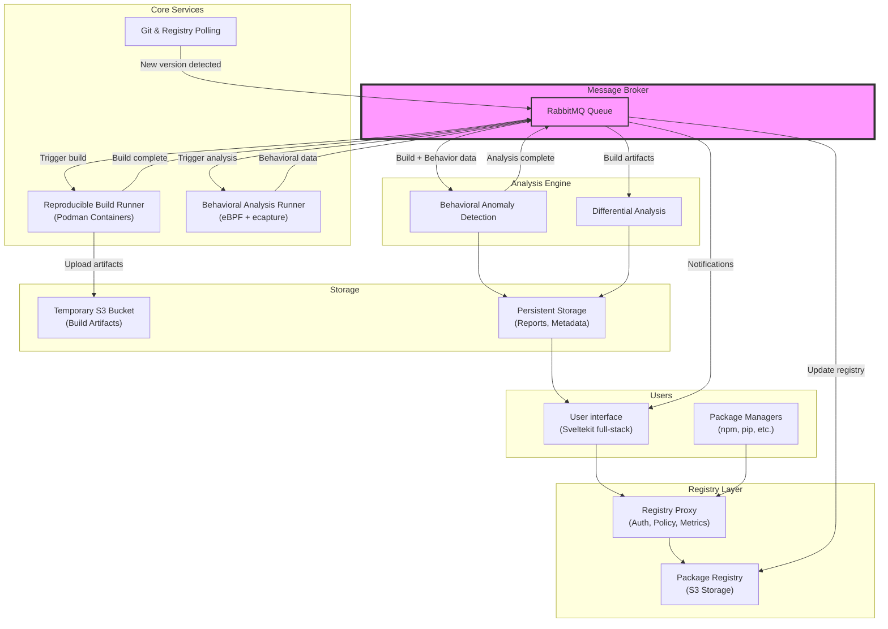

+++
title = "Architectural Design and Components"
authors = ["cheongyx@cardiff.ac.uk"]
reviewers = ["ReadB5@cardiff.ac.uk"]
creation = "2026-01-30"
+++

## Goals and constraints

- **Security**: We are a cybersecurity startup. If we aren't ourselves secure, we lose credibility
- **Scalability**: There are millions of packages in NPM. If we are successful, we need to be capable of achieving a
  similar scale.
- **Organizational efficiency**: We have 5 developers working mostly asynchronously. We want to limit the amount of
  required coordination.

The main risk is security. As part of reproducible builds and behavioral analysis, we are required to run possible
malicious code.

## Proposal

Event-driven service-oriented architecture. We break the system down into components and connect them via a message
queue (RabbitMQ).

## Core Components

### Registry

This is our main "user" interface. Private registries are already a common thing, meaning that most package managers
support easily changing custom registries and that we don't have to build our own package manager.

Preferably, we would not need to build our own registry as there are many open source options. The main constraints of
choosing a registry is:

1. Has APIs available for us to automate the process of adding packages
2. Has a storage back-end that allows us to store data in S3, or otherwise scalable
3. Well maintained

We may also need a proxy that sits in front of the registry to:

- Handle authentication
- Record usage per user
- Policy-based access control for things like risk acceptance, CVEs, etc.

### User interface

This component will be fairly simple. We need users to be able to log in, request packages to be verified, issue API
keys, and view the status of current packages.

We have chosen Sveltekit as the full-stack framework. This is so that we can integrate `Betterauth` without the the
security concerns of React Server Components. It is also very close to standard HTML/JS, making it familiar even if you
haven't used it before.

While this does make it a different back-end to the rest of our system, we can make use of RabbitMQ for communication
such that we are still using a unified interface.

### Git and package registry polling

This component is responsible for looking for new release versions on both registries and git sources. It is what
triggers reproducible builds and behavioral analysis. This is relatively simple, though we do want to handle rate limits
and caching for git sources (so we don't git clone a huge repo every time with its full history).

One major task is deciding how to match releases on registries to the corresponding release on GitHub/GitLab/etc and the
specific commit that would lead to a reproducible build. This is deferred for a future RFC as it requires
experimentation with different approaches.

### Reproducible builds

We are running user-controlled code here which may be computationally and memory intensive. To be safe, builds should be
run in either virtual machines or containers. For simplicity, we begin by only supporting rootless containers (Podman).
However, the interface should be abstracted such that it is possible to swap the underlying implementation without
changing high level signatures.

Reproducible builds should run on ephemeral nodes distinct from the master node such that a container escape does not
affect the rest of our system. These nodes should also not contain any secrets. Instead, it communicates over the queue
broker about its task and has permission only to upload to a temporary S3 bucket for output artifacts.

Currently, no behavioral analysis is done on the build process, but instead just the installation and runtime steps. It
is, however, a future goal to also do behavioral anomaly detection on the build, which should catch suspicious activity
of transitive dependencies.

### Behavioral analysis runner

Similar to reproducible builds, we are running possibly malicious code, and therefore require the same isolation.
`cgroups` are currently the easiest way to record behavioral information from an external process, whereas virtual
machines would require an agent within the instance, potentially allowing malicious packages to falsify reports. As
such, we can only use containers rather than virtual machines here.

What the behavioral analysis runner should do is to:

1. Install a given package
2. Run code that makes use of the package
3. Record behavior such as file reads, network data, or even raw syscall statistics
4. Return the data to the detection engine

A good tool is <https://github.com/gojue/ecapture> which allows for the decryption of HTTPS traffic without being
detectable by the underlying program using `eBPF`. We will also have to write our own custom eBPF for recording other
data.

### Behavioral anomaly detection

There are a few signals we can use to detect a malicious package:

- If the behavioral pattern of reproducible builds starts differing from the release package on NPM or other public
  registries
- If a new network endpoint is called unseen in previous versions of the package
- File reads outside the current working directory differing from prior behavior
- We can make the environment of the analysis runner a honeypot, including environment variables, secrets, and other
  files that an attacker is likely to ex filtrate. If we spot the secret in a decrypted request via `ecapture`, that
  would be flagged as malicious

More methods can be investigated based on case studies of malware samples. These methods are likely to cause false
positives once in a while, and flags should always be investigated by a human before being reported publicly. In the
meantime, new versions are blocked from our secure registry.

### Package binary and source differential analysis

This is one of the hardest sections, and most of it will be left for a later sprint. The current workflow would be to
simply assume reproducible builds and detect when a build is not reproducible. A future iteration could compute the
derivative of the difference (difference of the difference over time) to detect whether the difference is a simple
timestamp or entirely new code has been added to one version.

### Queue broker (RabbitMQ)

This is what ties everything together. Each of our components will need to communicate with one another. Rather than
rolling our own distributed infrastructure, we make use of RabbitMQ. For example, once the polling service detects a new
version, it sends off the data to the reproducible build and behavioral analysis runner in parallel. With multiple
runner nodes, this allows distributing tasks only to free runners and queuing when no runners are available. Once the
reproducible build is done, it will also be sent to the behavioral analysis runner and differential analysis engine.
When both runners are complete, the collected data will then be analyzed by the anomaly detection engine. Finally, when
everything is done, a report is generated, artifacts uploaded, and depending on whether anything was flagged,
notifications sent out.

### Stretch goal: Malicious diff detection with AI

Not every malicious behavior is obvious. Some may only trigger in very specific circumstances, which makes it difficult
to catch, especially when both source and distribution are compromised. One solution is manual code review of every
commit. However, that is expensive in terms of human resources. These days, AI have gotten close to basic junior level
developer capability. As such, it should be possible to utilize it for detecting malicious commits given the right
harness and context.

## Design Diagram



## Open Questions

1. Front-end framework compatible with `Betterauth`?

**Resolved: Choose Sveltekit instead of NextJS, and no Go back-end**

Discord transcript on framework choice:

```plain
Currently evaluating our options to deal with authentication
Betterauth looks pretty good
we wanted to use it before but bailed since we didn't need anything complex
but this time we're gonna be handling user roles and stuff like that
and also our auth needs to actually be secure
but but but
Betterauth is JS
and requires a JS back-end
it has plugins to use in Go
but you still need the JS back-end running somewhere
They support a variety of frameworks
but, if we wanna do our front-end in React, that means we need to use React Server Components (RSC) again
If you guys remember our last project and how bad the security issues were...
it might be a good idea to use a different framework
We technically can still use React, and set it up with one of the back-end frameworks instead (Express, Nitro, etc) and then hook React up to that, rather than risk RSC
but hey, Sveltekit might actually be a good idea
I personally do not care at all about what the front-end is written in, so don't wanna pressure or anything
Just saying that working in security, we may not want to be using RSC of all things (They literally still haven't removed the ⁨eval⁩'s in their code, just added a bunch of ⁨if⁩ statements before it to stop it from getting called)
Or we could just not use betterauth and roll our own
but that is a fair amount of work
they also handle API keys with different scopes like github has
which we want
```
